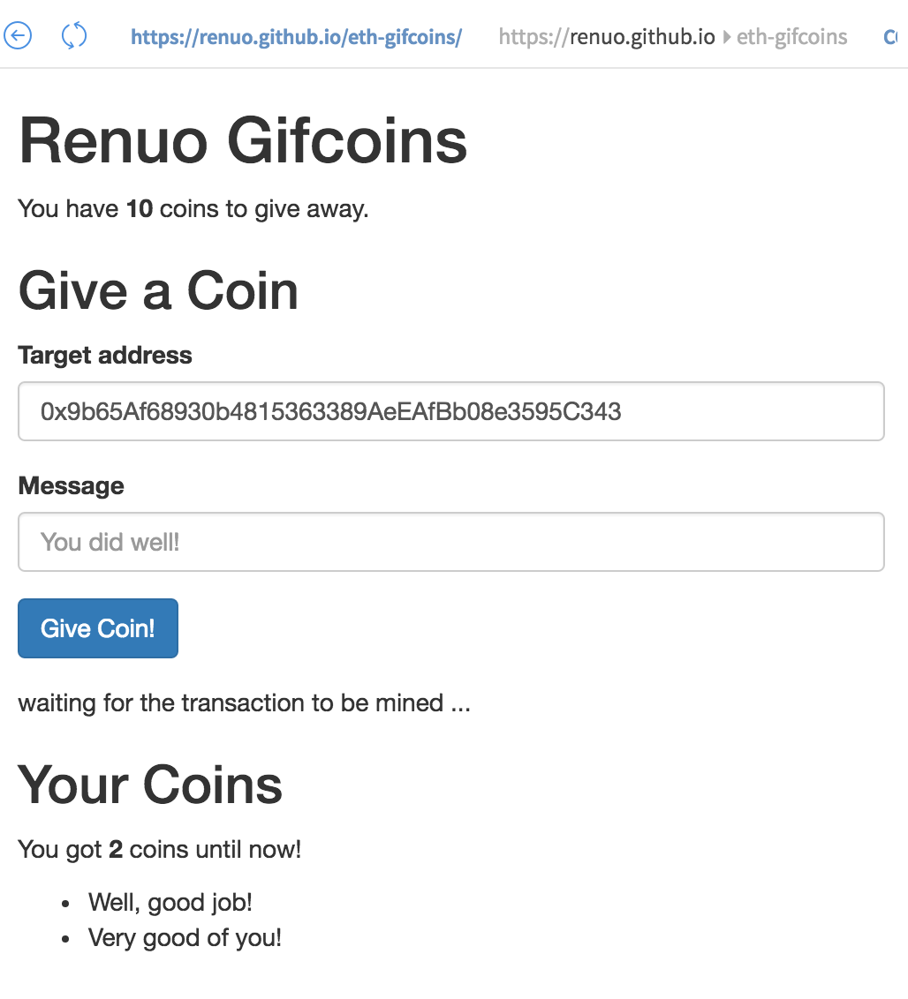

# eth-gifcoins

This is the result of a Saturday's investigation about Ethereum. We tried to rebuild [Gifcoins](https://gifcoins.io/)
with a smart contract.

If you call https://renuo.github.io/eth-gifcoins/ in [Mist](https://github.com/ethereum/mist) you get 10 tokens every month 
to be transferred into coins when you send someone a message.

<kbd>
  
</kbd>

Read more about it [here](https://coredump-ch.gitbooks.io/ethereum-hacking-day/content/).
